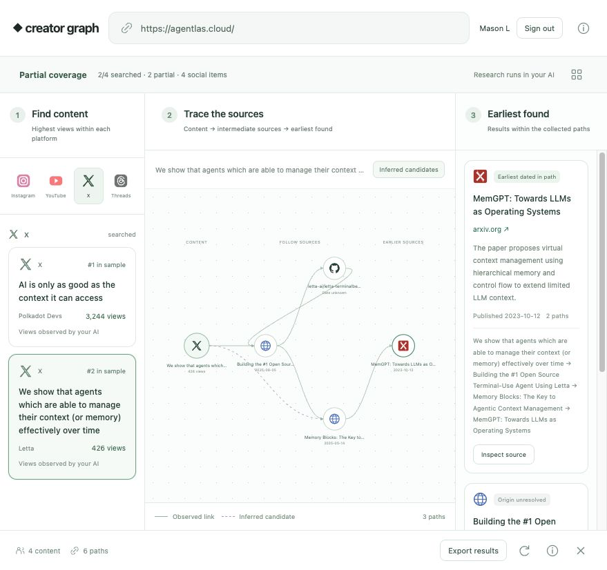
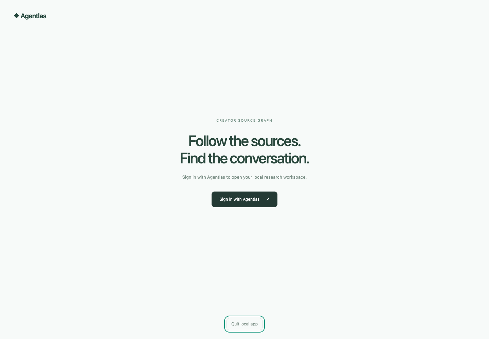

# Creator Source Graph

**Find creator content on Instagram, YouTube, X and Threads, then trace its sources.**

Creator Source Graph is an open-source local research app for Codex and Claude Code. Your existing AI host discovers public content, checks available view counts, follows source links, and saves a browser graph on your computer. No model or platform API keys are required for the skill workflow.



## Install and open with your AI host

In a local Codex or Claude Code session with shell, web search and browser tools, send:

```text
https://github.com/agentlas-ai/creator-source-graph
Install and open this app. Then research creators covering https://agentlas.cloud.
```

The host reads [the setup instructions](AGENTS.md), installs the app and personal skill, opens the browser and prompts you to sign in with Agentlas. After authentication, it continues the original research target. If sign-in is still pending, it checks login status before continuing; it does not claim research has already run.

From the obtained app folder, the host runs `./runtime/node cli.mjs setup --host codex <target-url>` or `./runtime/node cli.mjs setup --host claude <target-url>` (use `node` for source installations or `runtime\node.exe` on Windows). It reads the installed skill from the setup receipt and continues in the same session. Without a research target, setup opens the app and asks what to investigate; the installation repository URL is not automatically the target.

Your host supplies reasoning, search and browser execution. Its existing subscription, tool availability, permissions and usage limits apply. Installing the app does not add missing host tools. A standalone browser cannot perform AI research by itself, and a cloud-only host cannot reach this machine's loopback app.

## Read the graph from left to right

- **Left — discover content.** Start with Instagram, YouTube, X and Threads. Inspect each post, creator, observation date and available views. Rank confirmed views within each platform; unknown views remain unknown, and likes or search snippets are not substituted for views. This is a bounded discovery sample, not a global popularity ranking.
- **Middle — trace intermediate sources.** Follow explicit hyperlinks or URL citations from a post to projects, articles, papers and other material, then continue upstream. Inspect each connection's supporting page.
- **Right — inspect the earliest source found.** Compare the upstream sources discovered in this investigation. A terminal node or early publication date does not prove the world's first origin. A possible source relationship supported by semantic and chronological evidence remains labelled **inferred**, with its rationale and evidence, separate from explicit links.

Hover nodes and platform logos for original URLs, short summaries and collection status. Export JSON to review the investigation. Source scores describe paths in the collected sample, not audience overlap, market share or conversion.

## Download or run from source

Get the current packages from [GitHub Releases](https://github.com/agentlas-ai/creator-source-graph/releases/latest):

| Package | Download | Launch after extracting |
| --- | --- | --- |
| macOS Apple Silicon | [ZIP](https://github.com/agentlas-ai/creator-source-graph/releases/latest/download/creator-source-graph-macos-arm64.zip) | `Start.command` |
| macOS Intel | [ZIP](https://github.com/agentlas-ai/creator-source-graph/releases/latest/download/creator-source-graph-macos-x64.zip) | `Start.command` |
| Windows x64 | [ZIP](https://github.com/agentlas-ai/creator-source-graph/releases/latest/download/creator-source-graph-windows-x64.zip) | `Start.bat` |
| Linux x64 | [tar.gz](https://github.com/agentlas-ai/creator-source-graph/releases/latest/download/creator-source-graph-linux-x64.tar.gz) | `./start.sh` |
| Portable source | [ZIP](https://github.com/agentlas-ai/creator-source-graph/releases/latest/download/creator-source-graph-source.zip) | `npm start` |

Bundled packages include Node.js; the source ZIP requires Node.js 20 or newer. [SHA256 checksums](https://github.com/agentlas-ai/creator-source-graph/releases/latest/download/SHA256SUMS) accompany the downloads. Cross-platform package availability does not imply that every operating system has been verified with a real interaction.

To run from source, install [Node.js](https://nodejs.org/) 20 or newer, then:

```sh
git clone https://github.com/agentlas-ai/creator-source-graph.git
cd creator-source-graph
npm start
```

No npm dependencies need to be installed. The launcher starts the local server and opens the browser. Sign in with your Agentlas account to open your local graph.

## Sign in with Agentlas

The first skill invocation opens the Agentlas login screen. After you sign in, the browser returns to Creator Source Graph and the AI continues with the product URL you supplied. If login takes longer than the host's wait, the skill checks login status and resumes the same request.

Agentlas login identifies your local workspace. It does not replace your Codex or Claude Code subscription. No model or search API key is required. Graphs stay on your computer and are separated by Agentlas account. The app does not upload your workspace to a central graph service; signing in on another computer does not download a cloud copy.

Use **Sign out** to return to the login screen. The app keeps your local graph for your next sign-in. On upgrade, an existing unassigned workspace is preserved and copied into the first signed-in account's local workspace; subsequent accounts start separately.



## Connect Codex or Claude Code

For a downloaded runtime-bundled package, use its installer helper. It uses the included Node.js runtime:

| Platform | Install skills for both hosts |
| --- | --- |
| macOS | `Install-Skills.command` |
| Windows | `Install-Skills.bat` |
| Linux | `./install-skills.sh` |

For a source checkout with Node.js available, install from the app directory:

```sh
node cli.mjs install --host both
```

Or use:

```sh
npm run install:skills -- --host both
```

Start a new AI session after installation so the host discovers the skill. Your host must have the relevant tools enabled and permission to use them. Subscription plans, tool availability, limits, and host configuration vary; installing this skill does not add unavailable search or browser capabilities.

In **Claude Code**:

```text
/creator-source-graph https://agentlas.cloud
```

In **Codex**:

```text
$creator-source-graph https://agentlas.cloud
```

You can add a brief, such as “Find creators covering AI agent workflows and trace the public sources they cite.” Complete Agentlas login when prompted. The agent then researches public pages, submits structured observations to the local app, and reports what it could verify. Keep the app open while reviewing the graph.

## How it works

```text
Product URL + research brief
          ↓
Codex / Claude Code + installed skill
          ↓
Agentlas sign-in → account's local workspace
          ↓
Host reasoning, web search, browser observations
          ↓
Structured research batches → local app → browser source graph
```

The browser app does not run an autonomous LLM. Research progresses while an AI host is executing the skill. The app's HTTP collection and observations submitted by an AI agent have different provenance; one must not be mistaken for the other.

Local-first means the workspace and graph are stored on your machine. Your AI host and any public sites it visits still follow their own data policies. Review a JSON export before sharing it.

## CLI reference

Run commands from the app directory:

| Command | Purpose |
| --- | --- |
| `node cli.mjs setup --host codex [target-url]` | Install or reuse the current host skill, open sign-in/graph and preserve the research target. Use `claude` for Claude Code. |
| `node cli.mjs install --host both` | Install the skill for Codex and Claude Code. |
| `node cli.mjs login --wait-seconds 90` | Open Agentlas login and wait for sign-in. |
| `node cli.mjs login status` | Check login without reopening a browser. |
| `node cli.mjs logout` | Sign out of the local app. |
| `node cli.mjs start https://agentlas.cloud` | Sign in if needed, then start a research run for the original URL. |
| `node cli.mjs status [runId]` | List research runs or inspect one run. |
| `node cli.mjs submit <runId> <json-file\|->` | Submit a structured batch from a file or standard input. |
| `node cli.mjs export [runId]` | Export the local workspace, optionally with run status. |
| `node cli.mjs stop <runId>` | Cancel a research run while keeping the app available. |

A run records research progress; starting one does not launch or purchase an AI model. Invoke the installed skill in your AI host to perform the research.

## Structured batch input

The skill handles submissions for normal use. For custom host workflows, [the import schema](skills/creator-source-graph/references/import-schema.md) documents bounded records, view-count provenance, platform coverage and relationship evidence. Submit to the exact run ID returned by `start`:

```sh
node cli.mjs submit <runId> batch.json
```

Use search-only records for discovery candidates. Record original-page observations only after opening the exact source. Preserve unknown counts as absent or null. Check the exact run status before retrying a submission whose outcome is uncertain.

## Reading the evidence

An explicit link records a public connection. It does **not** prove influence, endorsement, that a creator read the destination, or when the link first appeared. Inferred source candidates require recorded semantic and chronological evidence and a rationale. They remain hypotheses, separate from explicit citation paths; neither kind establishes a global first origin.

Search results are discovery leads, not proof of a page's full contents. Creator identity, publication dates, platform access, and view counts may be unavailable. Unknown values remain unknown rather than becoming zero. Private conversations, closed communities, and inaccessible content are outside the visible sample.

Source scores describe paths and topic relevance in the collected sample. They are not audience reach, market share, conversion forecasts, or a ranking of all creators. Verify the supporting pages before using research for a business decision.

The app stores source metadata and selected links, not copied article paragraphs. Do not submit private data or raw page transcripts as research records.

## License

[MIT](LICENSE) — copyright 2026 Appbridge Inc.
